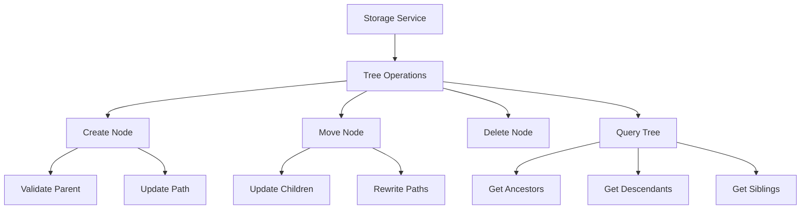

# Architecture Decision Record: Storage Tree Implementation

## Status

Accepted

## Date

2025-06-17

## Context

The media manager needs to support hierarchical organization of storage locations (cabinets, shelves, bins, drawers) with efficient querying capabilities. Key requirements include:

1. Data Structure Needs:
   - Support for parent-child relationships
   - Efficient ancestor/descendant queries
   - Support for moving subtrees
   - Prevention of cycles in the hierarchy

2. Performance Requirements:
   - Fast tree traversal operations
   - Efficient path-based queries
   - Minimal query complexity for common operations

3. MongoDB Considerations:
   - No built-in tree structure support
   - Limited transaction support
   - Efficient array querying capabilities

4. Use Cases:
   - Finding all items in a cabinet (including nested storage)
   - Moving a shelf between cabinets
   - Validating proper tree structure
   - Preventing circular references

## Decision

We will implement a materialized path pattern for the storage hierarchy with the following components:

1. Data Model:
```javascript
{
  _id: ObjectId,
  name: String,
  type: Enum['cabinet', 'shelf', 'bin', 'drawer'],
  parent_id: Optional[ObjectId],
  path: Array<ObjectId>,  // Materialized path for efficient queries
  metadata: {
    capacity: Optional[Number],
    dimensions: Optional[String],
    location: Optional[String]
  }
}
```

2. Path Management:
- Path array contains ordered list of ancestor IDs
- Service layer responsible for path generation and updates
- Model layer provides basic validation

3. Implementation Strategy:


4. Validation Rules:
- Model Layer:
  - Parent ID must exist in path if present
  - Path cannot be empty if parent_id exists
  - Basic type validation
- Service Layer:
  - Full cycle detection
  - Parent existence validation
  - Type hierarchy validation
  - Cascading updates

5. Query Patterns:
```javascript
// Find all descendants
db.storage.find({ path: parentId })

// Find immediate children
db.storage.find({ parent_id: parentId })

// Find ancestors
db.storage.find({ _id: { $in: node.path } })

// Find siblings
db.storage.find({ parent_id: node.parent_id })
```

## Consequences

### Positive

- Fast querying for common operations
- Simple path-based ancestor/descendant lookups
- Easy to implement and understand
- Efficient array indexing in MongoDB
- Good read performance

### Negative

- Write operations require cascading updates
- Path array size limited by MongoDB document size
- Need to maintain path consistency
- Additional storage space for paths

### Neutral

- Trade-off between read and write performance
- Need for service layer validation
- Path updates must be atomic

## Alternatives Considered

### Parent Reference Only

Simple parent-child relationship without paths.

#### Pros
- Simpler data model
- Easier updates
- Less storage space

#### Cons
- Recursive queries needed for tree traversal
- Poor performance for deep trees
- Complex ancestor/descendant queries

### Nested Sets

Using left/right numbering for tree structure.

#### Pros
- Very efficient reads
- Good for read-heavy workloads
- Built-in ordering

#### Cons
- Complex write operations
- Expensive tree modifications
- Difficult to maintain

### Adjacency List

Using a separate collection for relationships.

#### Pros
- Flexible relationship modeling
- Good for complex relationships
- Easy to modify structure

#### Cons
- More complex queries
- Additional collection to maintain
- Performance overhead

## Compliance

- Follows MongoDB best practices for tree structures
- Implements proper validation at all levels
- Maintains data integrity constraints

## Related Decisions

- [ADR-001](001-technology-stack.md): Technology Stack Selection
- [ADR-002](002-testing-strategy.md): Testing Strategy Implementation

## References

- [MongoDB Tree Structure Documentation](https://www.mongodb.com/docs/manual/tutorial/model-tree-structures/)
- [Materialized Paths in MongoDB](https://www.mongodb.com/docs/manual/tutorial/model-tree-structures-with-materialized-paths/)
- systemPatterns.md: Tree Structure Pattern section

## Notes

The service layer implementation will be critical for maintaining path consistency. Key implementation notes:

1. Path Updates:
```python
def update_paths(node_id: str, new_parent_id: str):
    # 1. Get current node and its children
    # 2. Calculate new path
    # 3. Update node's path
    # 4. Update all children's paths
    # 5. Validate no cycles created
```

2. Performance Optimization:
- Index on `path` array
- Index on `parent_id`
- Batch updates for path modifications
- Caching for frequently accessed paths
