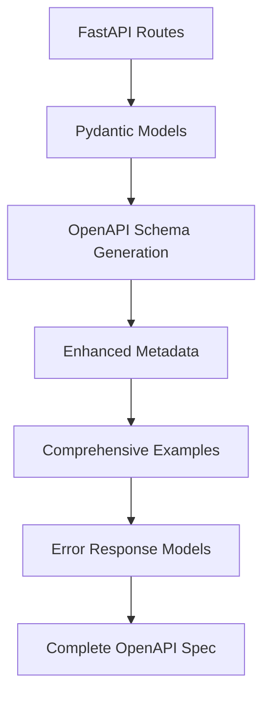
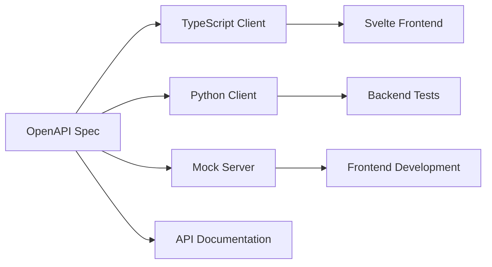
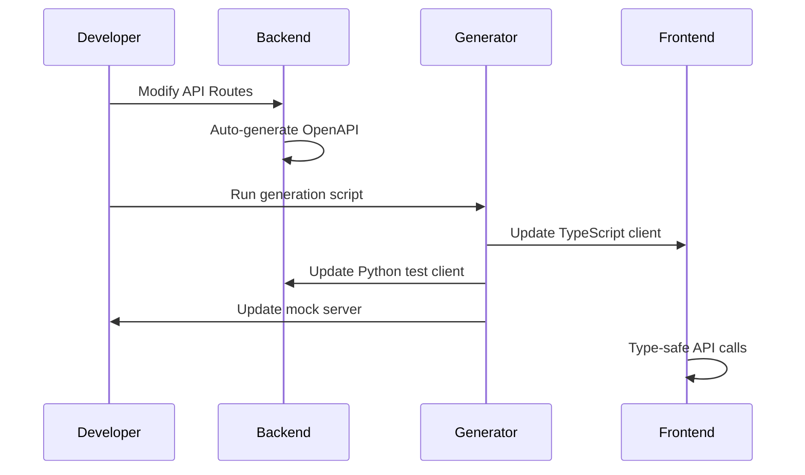

# ADR-004: OpenAPI Client Generation Architecture

## Status
Proposed

## Context

The Media Manager project has a well-established FastAPI backend with comprehensive API coverage for authentication, movie management, and storage operations. As we move toward frontend development with Svelte, we need to establish a robust system for API integration that ensures type safety, reduces integration bugs, and maintains consistency between backend and frontend.

### Current Challenges
- Manual API integration is error-prone and time-consuming
- No type safety between backend Python models and frontend TypeScript
- API changes require manual updates across multiple codebases
- Testing requires manual API client creation
- No standardized error handling patterns
- Lack of mock server capabilities for frontend development

### Requirements
- Type-safe API client generation for TypeScript/Svelte frontend
- Automated client generation as part of build process
- Mock server generation for independent frontend development
- API validation tools to ensure specification compliance
- Multi-language client support (TypeScript primary, Python for testing)
- Integration with existing FastAPI OpenAPI generation
- Future CI/CD pipeline compatibility

## Decision

We will implement a comprehensive OpenAPI-based client generation system using OpenAPI Generator with the following architecture:

### Core Technology Stack
- **OpenAPI Generator**: Primary tool for client generation
- **TypeScript Fetch Generator**: For Svelte frontend integration
- **Python Generator**: For backend testing and validation
- **Node.js Express Mock Server**: For frontend development
- **FastAPI OpenAPI**: Enhanced with comprehensive metadata

### Architecture Components

#### 1. Enhanced OpenAPI Documentation

#### 2. Client Generation Pipeline

#### 3. Development Workflow Integration

### Implementation Strategy

#### Phase 1: Foundation (Week 1)
- Enhance FastAPI OpenAPI metadata with comprehensive examples
- Create standardized error response models
- Implement operation summaries and descriptions
- Add server information and contact details

#### Phase 2: Client Generation (Week 2)
- Set up OpenAPI Generator CLI
- Create TypeScript client generation scripts
- Integrate with npm build process
- Implement file watching for development

#### Phase 3: Mock Server (Week 3)
- Generate Node.js Express mock server
- Create realistic mock data enhancement scripts
- Integrate mock server with frontend development workflow
- Add mock data management tools

#### Phase 4: Validation & Testing (Week 4)
- Implement API specification validation
- Create Python client for backend testing
- Add request/response validation middleware
- Set up automated validation in development

#### Phase 5: Multi-Language Support (Week 5)
- Extend to additional client languages as needed
- Create unified generation automation scripts
- Implement version management for generated clients
- Prepare for CI/CD integration

## Alternatives Considered

### Alternative 1: Manual API Integration
**Pros:**
- Full control over API client implementation
- No additional tooling dependencies
- Custom optimization opportunities

**Cons:**
- High maintenance overhead
- Error-prone manual synchronization
- No type safety guarantees
- Inconsistent error handling
- Time-consuming updates

**Decision:** Rejected due to maintenance overhead and lack of type safety.

### Alternative 2: GraphQL with Code Generation
**Pros:**
- Strong type safety
- Efficient data fetching
- Excellent tooling ecosystem
- Built-in introspection

**Cons:**
- Requires complete API redesign
- Learning curve for team
- Overkill for CRUD operations
- Additional complexity layer

**Decision:** Rejected due to existing REST API investment and project scope.

### Alternative 3: tRPC for Type Safety
**Pros:**
- End-to-end type safety
- Excellent TypeScript integration
- Minimal runtime overhead
- Great developer experience

**Cons:**
- Requires TypeScript backend migration
- Limited to TypeScript ecosystem
- Breaking change to existing API
- Additional learning curve

**Decision:** Rejected due to existing Python/FastAPI investment.

### Alternative 4: Swagger Codegen (Legacy)
**Pros:**
- Mature tooling
- Wide language support
- Established patterns

**Cons:**
- Less active development
- Older generation patterns
- Limited customization options
- Superseded by OpenAPI Generator

**Decision:** Rejected in favor of more modern OpenAPI Generator.

## Consequences

### Positive Consequences

#### Development Efficiency
- **Type Safety**: Complete type safety from backend to frontend
- **Automatic Synchronization**: API changes automatically reflected in clients
- **Reduced Bugs**: Compile-time catching of API integration issues
- **Faster Development**: IntelliSense and autocomplete for all API operations
- **Consistent Patterns**: Standardized error handling and request patterns

#### Code Quality
- **Living Documentation**: OpenAPI spec stays in sync with implementation
- **Validation**: Automated API specification validation
- **Testing**: Generated Python client for comprehensive API testing
- **Mock Development**: Independent frontend development with realistic mocks

#### Maintainability
- **Single Source of Truth**: OpenAPI specification drives all client generation
- **Version Management**: Semantic versioning for API and generated clients
- **Automated Updates**: Build process integration ensures consistency
- **Future-Proof**: Easy extension to additional languages and tools

### Negative Consequences

#### Complexity
- **Build Process**: Additional build steps and dependencies
- **Learning Curve**: Team needs to understand OpenAPI Generator
- **Debugging**: Generated code can be harder to debug
- **Tooling Dependencies**: Reliance on external code generation tools

#### Maintenance Overhead
- **Generator Updates**: Need to keep OpenAPI Generator updated
- **Custom Modifications**: Generated code modifications require careful handling
- **Build Failures**: Generation failures can block development
- **Documentation Maintenance**: OpenAPI metadata requires ongoing attention

### Mitigation Strategies

#### For Complexity
- **Comprehensive Documentation**: Detailed implementation guides and examples
- **Training**: Team training on OpenAPI Generator and best practices
- **Debugging Tools**: Enhanced logging and error reporting in generated clients
- **Fallback Options**: Manual client creation as backup option

#### For Maintenance
- **Automated Updates**: Dependabot for generator version management
- **Version Pinning**: Pin generator versions for stability
- **Testing**: Comprehensive testing of generated clients
- **Monitoring**: Build process monitoring and alerting

## Implementation Plan

### Week 1: Foundation
- [ ] Enhance FastAPI OpenAPI metadata
- [ ] Create standardized error response models
- [ ] Add comprehensive operation examples
- [ ] Implement server and contact information

### Week 2: TypeScript Client Generation
- [ ] Install and configure OpenAPI Generator CLI
- [ ] Create TypeScript client generation scripts
- [ ] Integrate with npm build process
- [ ] Set up file watching for development

### Week 3: Mock Server Setup
- [ ] Generate Node.js Express mock server
- [ ] Create mock data enhancement scripts
- [ ] Integrate with frontend development workflow
- [ ] Add mock server management tools

### Week 4: Validation and Testing
- [ ] Implement API specification validation
- [ ] Create Python client generation
- [ ] Add request/response validation middleware
- [ ] Set up automated validation scripts

### Week 5: Integration and Documentation
- [ ] Create unified generation automation
- [ ] Implement version management
- [ ] Complete documentation and examples
- [ ] Prepare CI/CD integration plan

## Success Metrics

### Technical Metrics
- **Type Safety Coverage**: 100% of API operations have TypeScript types
- **Build Success Rate**: >95% successful client generation builds
- **API Validation**: 100% OpenAPI specification validation success
- **Test Coverage**: Generated Python client covers all API endpoints

### Development Metrics
- **Integration Bug Reduction**: 50% reduction in API integration bugs
- **Development Speed**: 30% faster frontend API integration
- **Documentation Accuracy**: Living documentation always in sync
- **Developer Satisfaction**: Positive feedback on type safety and tooling

### Maintenance Metrics
- **Update Frequency**: Automated client updates with every API change
- **Version Consistency**: Generated clients always match API version
- **Build Time**: Client generation adds <30 seconds to build process
- **Error Resolution**: Clear error messages for generation failures

## References

- [OpenAPI Specification 3.0](https://swagger.io/specification/)
- [OpenAPI Generator Documentation](https://openapi-generator.tech/)
- [FastAPI OpenAPI Integration](https://fastapi.tiangolo.com/tutorial/metadata/)
- [TypeScript Fetch Generator](https://openapi-generator.tech/docs/generators/typescript-fetch/)
- [ADR Template](https://github.com/joelparkerhenderson/architecture-decision-record)

## Approval

- **Proposed by**: Development Team
- **Date**: 2025-01-17
- **Reviewers**: [To be assigned]
- **Status**: Awaiting Review

---

*This ADR will be updated as implementation progresses and new insights are gained.*
