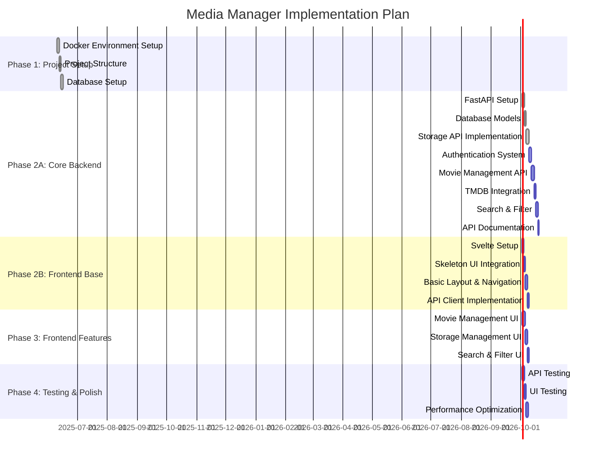

# Media Manager Implementation Plan

## Overview
This document outlines the implementation phases and checklists for the Media Manager project. Each phase has specific deliverables and acceptance criteria to ensure consistent progress across development sessions.

## Timeline
Estimated timeline is flexible and can be adjusted based on development sessions availability.

## Implementation Phases

### Phase 1: Project Setup (Completed)
- [x] Docker Environment Setup
  - [x] Create docker-compose.yml
  - [x] Frontend container configuration
  - [x] Backend container configuration
  - [x] MongoDB container configuration
  - [x] Development environment variables
  - [x] Hot-reload setup for development

- [x] Project Structure
  - [ ] Frontend scaffold (Pending Phase 2B)
    - [ ] Svelte project initialization
    - [ ] Skeleton UI setup
    - [ ] Basic component structure
  - [x] Backend scaffold
    - [x] FastAPI project initialization
    - [x] Project directory structure
    - [x] Dependencies management (using uv + pip-compile)
  - [x] Documentation structure
    - [x] API documentation setup
    - [x] Development guide
    - [x] Environment setup guide

- [x] Development Environment Setup
  - [x] Virtual environment management
  - [x] Development scripts (setup_dev.sh/ps1)
  - [x] Documentation for local development

- [x] Database Setup
  - [x] MongoDB initialization script
  - [x] Database connection configuration
  - [x] Basic schema design
  - [x] Data backup strategy

### Phase 2A: Core Backend (In Progress)

#### Storage API (Completed)
- [x] Storage Model Implementation
  - [x] Define storage schema with materialized path pattern
  - [x] Implement storage types (cabinet, shelf, bin, drawer)
  - [x] Add metadata support
  - [x] Create validation rules

- [x] Storage API Endpoints
  - [x] Create storage endpoint
  - [x] List storage endpoint
  - [x] Update storage endpoint
  - [x] Delete storage endpoint
  - [x] Get tree endpoint

- [x] Storage Tree Operations
  - [x] Parent-child relationship management
  - [x] Path generation and updates
  - [x] Cycle detection
  - [x] Cascading updates for subtrees

- [x] Storage API Testing
  - [x] Unit tests for storage model
  - [x] Integration tests for storage API
  - [x] Tree operation tests
  - [x] Validation tests

#### Authentication System (In Progress)
- [x] User Model Implementation
  - [x] Define user schema
  - [x] Password hashing
  - [x] User validation

- [x] Authentication API Endpoints
  - [x] User registration endpoint
  - [x] User login endpoint
  - [ ] Session management
  - [ ] Protected route middleware

- [ ] Authentication Testing
  - [x] User registration tests
  - [x] User login tests
  - [ ] Session management tests
  - [ ] Protected route tests

#### Movie Management API (Pending)
- [x] Movie Model Implementation
  - [x] Define movie schema
  - [x] Link to storage locations
  - [x] Support for metadata

- [ ] Movie API Endpoints
  - [ ] Create movie endpoint
  - [ ] Get movie endpoint
  - [ ] Update movie endpoint
  - [ ] Delete movie endpoint
  - [ ] List movies endpoint
  - [ ] Search movies endpoint

- [ ] TMDB Integration
  - [ ] TMDB API client
  - [ ] Movie metadata fetching
  - [ ] Cover image handling
  - [ ] Error handling for external API

- [ ] Movie API Testing
  - [ ] Unit tests for movie model
  - [ ] Integration tests for movie API
  - [ ] TMDB integration tests
  - [ ] Search functionality tests

#### API Documentation (Pending)
- [ ] OpenAPI/Swagger documentation
  - [ ] Authentication endpoints
  - [ ] Storage endpoints
  - [ ] Movie endpoints
  - [ ] Search endpoints

- [ ] Usage examples
  - [ ] Authentication flow
  - [ ] Storage management
  - [ ] Movie management
  - [ ] Search operations

### Phase 2B: Frontend Foundation (Pending)

#### Svelte Setup
- [ ] Initialize Svelte project
- [ ] Configure build system
- [ ] Set up development environment
- [ ] Configure hot module replacement

#### Skeleton UI Integration
- [ ] Install Skeleton UI
- [ ] Configure theme
- [ ] Create base components
- [ ] Implement responsive layout

#### Component Structure
- [ ] Create component hierarchy
- [ ] Implement shared components
- [ ] Set up routing
- [ ] Create layout components

#### API Client Implementation
- [ ] Create API client module
- [ ] Implement authentication handling
- [ ] Create service modules for each API
- [ ] Add error handling

### Phase 3: Frontend Features (Pending)

#### Movie Management UI
- [ ] Movie list view
- [ ] Movie detail view
- [ ] Add/edit movie forms
- [ ] TMDB search integration
- [ ] Cover image display

#### Storage Management UI
- [ ] Storage hierarchy view
- [ ] Storage detail view
- [ ] Add/edit storage forms
- [ ] Tree visualization
- [ ] Drag-and-drop organization

#### Search & Filter UI
- [ ] Search interface
- [ ] Filter components
- [ ] Results display
- [ ] Sorting options

### Phase 4: Testing & Polish (Pending)

#### API Testing
- [ ] End-to-end API tests
- [ ] Performance testing
- [ ] Load testing
- [ ] Security testing

#### UI Testing
- [ ] Component tests
- [ ] Integration tests
- [ ] End-to-end tests
- [ ] Accessibility testing

#### Performance Optimization
- [ ] API response optimization
- [ ] Database query optimization
- [ ] Frontend bundle optimization
- [ ] Caching strategy

## Acceptance Criteria

### Phase 2A: Core Backend
1. Storage API
   - ✅ All storage API endpoints implemented and tested
   - ✅ Tree operations working correctly
   - ✅ Proper validation and error handling
   - ✅ MongoDB schema validation working

2. Authentication System
   - ✅ User registration and login working
   - ⏳ Session management implemented
   - ⏳ Protected routes working correctly
   - ⏳ Proper error handling for auth failures

3. Movie Management API
   - ⏳ All movie API endpoints implemented and tested
   - ⏳ TMDB integration working correctly
   - ⏳ Search functionality implemented
   - ⏳ Proper error handling for TMDB API failures

4. API Documentation
   - ⏳ OpenAPI/Swagger documentation complete
   - ⏳ All endpoints documented
   - ⏳ Usage examples provided
   - ⏳ Authentication flow documented

### Phase 2B: Frontend Foundation
1. Svelte Setup
   - ⏳ Svelte project initialized and configured
   - ⏳ Development environment working
   - ⏳ Build system configured
   - ⏳ Hot module replacement working

2. Skeleton UI Integration
   - ⏳ Skeleton UI installed and configured
   - ⏳ Theme customized for Media Manager
   - ⏳ Base components created
   - ⏳ Responsive layout implemented

3. Component Structure
   - ⏳ Component hierarchy established
   - ⏳ Shared components implemented
   - ⏳ Routing configured
   - ⏳ Layout components created

4. API Client Implementation
   - ⏳ API client module created
   - ⏳ Authentication handling implemented
   - ⏳ Service modules for each API created
   - ⏳ Error handling implemented

## Development Session Notes
[Section for tracking progress between development sessions]

Date | Progress | Next Steps | Notes
-----|----------|------------|-------
2025-06-10 | Project setup initiated | Complete Docker configuration | Initial repository created
2025-06-15 | Database setup completed | Begin API implementation | MongoDB schema defined
2025-06-17 | Storage API implementation started | Complete storage endpoints | Tree structure ADR created
2025-06-25 | Storage API completed | Begin movie management API | All storage tests passing
2025-06-30 | Implementation plan updated | Continue with movie management API | Phase 2A in progress
