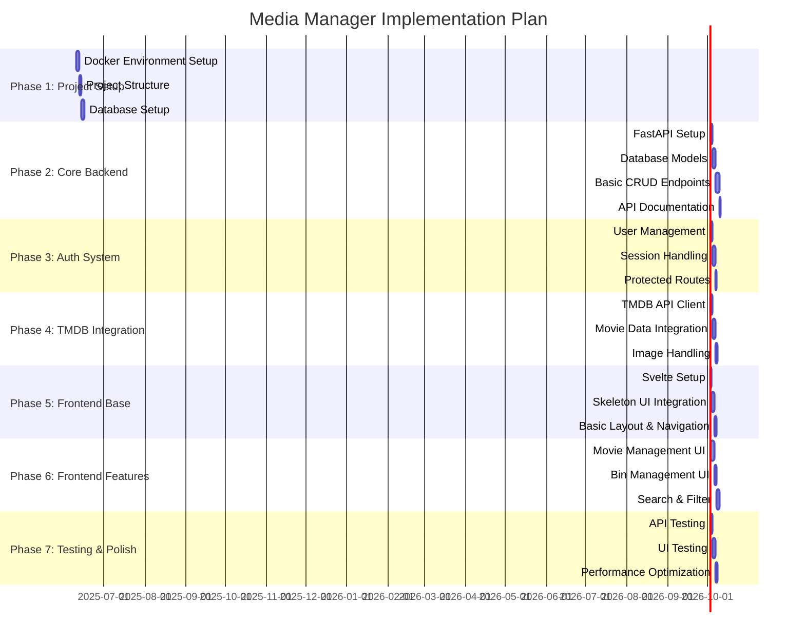

# Media Manager Implementation Plan

## Overview
This document outlines the implementation phases and checklists for the Media Manager project. Each phase has specific deliverables and acceptance criteria to ensure consistent progress across development sessions.

## Timeline
Estimated timeline is flexible and can be adjusted based on development sessions availability.



## Implementation Phases

### Phase 1: Project Setup (Estimated: 6 days)
- [x] Docker Environment Setup
  - [x] Create docker-compose.yml
  - [x] Frontend container configuration
  - [x] Backend container configuration
  - [x] MongoDB container configuration
  - [x] Development environment variables
  - [x] Hot-reload setup for development

- [x] Project Structure
  - [ ] Frontend scaffold
    - [ ] Svelte project initialization
    - [ ] Skeleton UI setup
    - [ ] Basic component structure
  - [x] Backend scaffold
    - [x] FastAPI project initialization
    - [x] Project directory structure
    - [x] Dependencies management (using uv + pip-compile)
  - [x] Documentation structure
    - [ ] API documentation setup
    - [x] Development guide
    - [x] Environment setup guide

- [x] Development Environment Setup
  - [x] Virtual environment management
  - [x] Development scripts (setup_dev.sh/ps1)
  - [x] Documentation for local development

- [ ] Database Setup
  - [ ] MongoDB initialization script
  - [ ] Database connection configuration
  - [ ] Basic schema design
  - [ ] Data backup strategy

### Phase 2: Core Backend
[To be detailed before starting Phase 2]

### Phase 3: Authentication System
[To be detailed before starting Phase 3]

### Phase 4: TMDB Integration
[To be detailed before starting Phase 4]

### Phase 5: Frontend Foundation
[To be detailed before starting Phase 5]

### Phase 6: Frontend Features
[To be detailed before starting Phase 6]

### Phase 7: Testing & Polish
[To be detailed before starting Phase 7]

## Phase 1 Detailed Breakdown

### Docker Environment Setup Checklist
1. Initial Setup
   - [ ] Create base docker-compose.yml
   - [ ] Define networks for service communication
   - [ ] Configure volume mounts for persistence

2. Frontend Container
   - [ ] Node.js base image selection
   - [ ] Svelte development environment
   - [ ] Hot-reload configuration
   - [ ] Port mapping (default: 3000)

3. Backend Container
   - [ ] Python base image selection
   - [ ] FastAPI development environment
   - [ ] Hot-reload configuration
   - [ ] Port mapping (default: 8000)

4. MongoDB Container
   - [ ] Official MongoDB image setup
   - [ ] Data persistence volume
   - [ ] Security configuration
   - [ ] Port mapping (default: 27017)

### Project Structure Checklist
1. Frontend Structure
   - [ ] Initialize Svelte project
   - [ ] Install Skeleton UI
   - [ ] Set up routing
   - [ ] Create base components structure:
     ```
     frontend/
     ├── src/
     │   ├── components/
     │   ├── routes/
     │   ├── stores/
     │   ├── lib/
     │   └── assets/
     ```

2. Backend Structure
   - [ ] Initialize FastAPI project
   - [ ] Create modular structure:
     ```
     backend/
     ├── app/
     │   ├── api/
     │   ├── core/
     │   ├── db/
     │   ├── models/
     │   └── services/
     ```

3. Documentation Structure
   - [ ] API documentation setup
   - [ ] Development guide
   - [ ] Environment setup guide

### Database Setup Checklist
1. MongoDB Setup
   - [ ] Create initialization scripts
   - [ ] Define collections:
     - movies
     - bins
     - users
     - sessions
   - [ ] Set up indexes
   - [ ] Create backup strategy

2. Database Configuration
   - [ ] Connection string setup
   - [ ] Environment variables
   - [ ] Security configuration

## Acceptance Criteria for Phase 1
1. Docker Environment
   - All containers start successfully
   - Services can communicate
   - Development hot-reload works
   - Volumes persist data

2. Project Structure
   - All directories created
   - Base configuration files in place
   - Documentation started

3. Database
   - MongoDB runs in container
   - Collections created
   - Test connection successful

## Development Session Notes
[Section for tracking progress between development sessions]

Date | Progress | Next Steps | Notes
-----|----------|------------|-------
