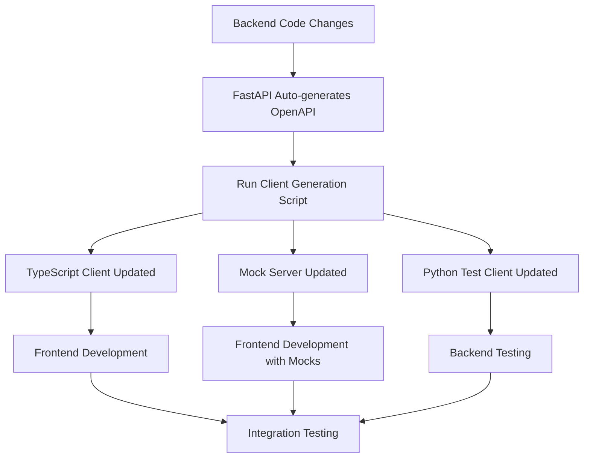

# OpenAPI Integration & Client Generation

## Overview

This document outlines the comprehensive implementation plan for enhancing OpenAPI documentation and establishing automated client generation for the Media Manager project. The implementation focuses on TypeScript client generation for the Svelte frontend while providing extensibility for additional languages and tooling.

## Current State

### Existing OpenAPI Support
- ✅ FastAPI automatically generates OpenAPI 3.0+ schemas
- ✅ Swagger UI available at `/docs`
- ✅ ReDoc available at `/redoc`
- ✅ Well-structured API with proper tags (auth, movies, storage)
- ✅ Comprehensive route coverage with authentication

### Areas for Enhancement
- 🔄 Limited response examples and error documentation
- 🔄 Missing client generation automation
- 🔄 No mock server for frontend development
- 🔄 Limited API validation tooling

## Implementation Phases

### Phase 1: Enhanced OpenAPI Documentation

#### 1.1 Improve OpenAPI Metadata
```python
# Enhanced FastAPI app configuration
app = FastAPI(
    title="Media Manager API",
    description="""
    Comprehensive API for managing physical media collections and storage locations.
    
    ## Authentication
    All endpoints require JWT authentication via session cookies.
    
    ## Rate Limiting
    API calls are rate-limited to prevent abuse.
    
    ## Error Handling
    All errors follow RFC 7807 Problem Details format.
    """,
    version="1.0.0",
    contact={
        "name": "Media Manager Team",
        "email": "support@mediamanager.local"
    },
    license_info={
        "name": "MIT",
        "url": "https://opensource.org/licenses/MIT"
    },
    servers=[
        {"url": "http://localhost:8000", "description": "Development server"},
        {"url": "https://api.mediamanager.local", "description": "Production server"}
    ]
)
```

#### 1.2 Enhanced Response Models
```python
from pydantic import BaseModel, Field
from typing import List, Optional

class ErrorResponse(BaseModel):
    """Standard error response model."""
    type: str = Field(..., description="Error type URI")
    title: str = Field(..., description="Human-readable error title")
    status: int = Field(..., description="HTTP status code")
    detail: str = Field(..., description="Detailed error description")
    instance: Optional[str] = Field(None, description="URI reference to specific occurrence")

class PaginatedResponse(BaseModel):
    """Generic paginated response model."""
    items: List[dict] = Field(..., description="List of items")
    total: int = Field(..., description="Total number of items")
    page: int = Field(..., description="Current page number")
    size: int = Field(..., description="Items per page")
    pages: int = Field(..., description="Total number of pages")
```

#### 1.3 Operation Examples
```python
@router.get(
    "/movies",
    response_model=PaginatedMovieResponse,
    responses={
        200: {
            "description": "List of movies retrieved successfully",
            "content": {
                "application/json": {
                    "example": {
                        "items": [
                            {
                                "id": "507f1f77bcf86cd799439011",
                                "title": "The Matrix",
                                "year": 1999,
                                "format": "Blu-ray",
                                "storage_id": "507f1f77bcf86cd799439012"
                            }
                        ],
                        "total": 150,
                        "page": 1,
                        "size": 10,
                        "pages": 15
                    }
                }
            }
        },
        401: {"model": ErrorResponse, "description": "Authentication required"},
        403: {"model": ErrorResponse, "description": "Insufficient permissions"}
    },
    summary="List movies in collection",
    description="Retrieve a paginated list of movies with optional filtering by storage location, format, or genre."
)
async def list_movies(...):
    pass
```

### Phase 2: Client Generation Setup

#### 2.1 OpenAPI Generator Installation
```bash
# Install OpenAPI Generator CLI
npm install -g @openapitools/openapi-generator-cli

# Verify installation
openapi-generator-cli version
```

#### 2.2 TypeScript Client Generation Script
```bash
#!/bin/bash
# scripts/generate-client.sh

set -e

echo "🚀 Generating TypeScript API client..."

# Ensure backend is running
if ! curl -f http://localhost:8000/health > /dev/null 2>&1; then
    echo "❌ Backend server not running. Please start with: cd backend && uvicorn app.main:app --reload"
    exit 1
fi

# Create output directory
mkdir -p frontend/src/lib/api

# Generate TypeScript client
openapi-generator-cli generate \
    -i http://localhost:8000/openapi.json \
    -g typescript-fetch \
    -o frontend/src/lib/api \
    --additional-properties=typescriptThreePlus=true,supportsES6=true,npmName=media-manager-api,npmVersion=1.0.0 \
    --global-property=models,apis,supportingFiles \
    --skip-validate-spec

echo "✅ TypeScript client generated successfully!"
echo "📁 Generated files in: frontend/src/lib/api"
```

#### 2.3 Package.json Integration
```json
{
  "scripts": {
    "generate:api": "./scripts/generate-client.sh",
    "dev": "npm run generate:api && vite dev",
    "build": "npm run generate:api && vite build",
    "watch:api": "nodemon --watch ../backend/app --ext py --exec 'npm run generate:api'"
  },
  "devDependencies": {
    "@openapitools/openapi-generator-cli": "^2.7.0",
    "nodemon": "^3.0.1"
  }
}
```

### Phase 3: Mock Server Generation

#### 3.1 Mock Server Setup
```bash
# Generate mock server
openapi-generator-cli generate \
    -i http://localhost:8000/openapi.json \
    -g nodejs-express-server \
    -o tools/mock-server \
    --additional-properties=serverPort=3001

# Install dependencies and start
cd tools/mock-server
npm install
npm start
```

#### 3.2 Mock Server Integration Script
```javascript
// tools/mock-server/enhance-mocks.js
const fs = require('fs');
const path = require('path');

// Enhance generated mocks with realistic data
const enhanceMocks = () => {
    const mockData = {
        movies: [
            {
                id: "507f1f77bcf86cd799439011",
                title: "The Matrix",
                year: 1999,
                format: "Blu-ray",
                storage_id: "507f1f77bcf86cd799439012",
                tmdb_id: 603,
                genre: ["Action", "Science Fiction"],
                runtime: 136,
                cover_image: "https://image.tmdb.org/t/p/w500/f89U3ADr1oiB1s9GkdPOEpXUk5H.jpg"
            }
        ],
        storage: [
            {
                id: "507f1f77bcf86cd799439012",
                name: "Living Room Cabinet - Shelf 1",
                description: "Top shelf of main entertainment center",
                type: "shelf",
                parent_id: "507f1f77bcf86cd799439013"
            }
        ]
    };

    // Write enhanced mock data
    fs.writeFileSync(
        path.join(__dirname, 'mock-data.json'),
        JSON.stringify(mockData, null, 2)
    );
};

enhanceMocks();
```

### Phase 4: API Validation Tools

#### 4.1 Request/Response Validation
```python
# backend/app/middleware/validation.py
from fastapi import Request, Response
from fastapi.middleware.base import BaseHTTPMiddleware
import json
import logging

class APIValidationMiddleware(BaseHTTPMiddleware):
    """Middleware to validate API requests and responses against OpenAPI schema."""
    
    async def dispatch(self, request: Request, call_next):
        # Log request details
        logging.info(f"API Request: {request.method} {request.url}")
        
        response = await call_next(request)
        
        # Log response details
        logging.info(f"API Response: {response.status_code}")
        
        return response
```

#### 4.2 Schema Validation Script
```python
# scripts/validate-api.py
import requests
import json
from openapi_spec_validator import validate_spec
from openapi_spec_validator.readers import read_from_filename

def validate_openapi_spec():
    """Validate the generated OpenAPI specification."""
    try:
        # Fetch OpenAPI spec from running server
        response = requests.get('http://localhost:8000/openapi.json')
        spec = response.json()
        
        # Validate specification
        validate_spec(spec)
        print("✅ OpenAPI specification is valid!")
        
        return True
    except Exception as e:
        print(f"❌ OpenAPI specification validation failed: {e}")
        return False

if __name__ == "__main__":
    validate_openapi_spec()
```

### Phase 5: Multi-Language Client Generation

#### 5.1 Python Client Generation
```bash
# Generate Python client for testing
openapi-generator-cli generate \
    -i http://localhost:8000/openapi.json \
    -g python \
    -o backend/tests/generated-client \
    --additional-properties=packageName=media_manager_client,projectName=media-manager-client
```

#### 5.2 Client Generation Automation
```bash
#!/bin/bash
# scripts/generate-all-clients.sh

set -e

echo "🚀 Generating all API clients..."

# TypeScript for frontend
echo "📝 Generating TypeScript client..."
./scripts/generate-typescript-client.sh

# Python for testing
echo "🐍 Generating Python client..."
./scripts/generate-python-client.sh

# Mock server
echo "🎭 Generating mock server..."
./scripts/generate-mock-server.sh

echo "✅ All clients generated successfully!"
```

## Development Workflow

### Workflow Diagram


### Daily Development Process
1. **Backend Changes**: Modify FastAPI routes/models
2. **Auto-Generation**: OpenAPI spec updates automatically
3. **Client Sync**: Run `npm run generate:api` to update clients
4. **Frontend Development**: Use type-safe API client
5. **Testing**: Validate with generated Python client

### File Watching Setup
```json
{
  "scripts": {
    "dev:watch": "concurrently \"npm run dev\" \"npm run watch:api\"",
    "watch:api": "nodemon --watch ../backend/app --ext py --exec 'npm run generate:api'"
  }
}
```

## Integration Points

### Frontend Integration (Svelte)
```typescript
// frontend/src/lib/api/client.ts
import { Configuration, DefaultApi } from './generated';

const config = new Configuration({
    basePath: 'http://localhost:8000',
    credentials: 'include', // Include cookies for session auth
});

export const apiClient = new DefaultApi(config);

// Usage in Svelte components
import { apiClient } from '$lib/api/client';

export async function loadMovies() {
    try {
        const response = await apiClient.listMovies();
        return response.items;
    } catch (error) {
        console.error('Failed to load movies:', error);
        throw error;
    }
}
```

### Testing Integration
```python
# backend/tests/test_api_client.py
from tests.generated_client import ApiClient, Configuration
from tests.generated_client.api.movies_api import MoviesApi

def test_movies_api_with_generated_client():
    """Test movies API using generated Python client."""
    config = Configuration(host="http://localhost:8000")
    
    with ApiClient(config) as api_client:
        movies_api = MoviesApi(api_client)
        
        # Test list movies
        response = movies_api.list_movies()
        assert response.total >= 0
        assert isinstance(response.items, list)
```

## Build Process Integration

### Development Build
```bash
# Development workflow
npm run dev:watch  # Starts dev server with API watching
```

### Production Build
```bash
# Production build process
npm run generate:api  # Generate latest client
npm run build         # Build frontend with generated client
```

### CI/CD Integration (Future)
```yaml
# .github/workflows/build.yml
name: Build and Test
on: [push, pull_request]

jobs:
  test:
    runs-on: ubuntu-latest
    steps:
      - uses: actions/checkout@v3
      
      - name: Start Backend
        run: |
          cd backend
          pip install -r requirements.txt
          uvicorn app.main:app --host 0.0.0.0 --port 8000 &
          
      - name: Generate API Client
        run: |
          cd frontend
          npm install
          npm run generate:api
          
      - name: Build Frontend
        run: |
          cd frontend
          npm run build
          
      - name: Test Generated Client
        run: |
          cd backend
          python -m pytest tests/test_generated_client.py
```

## Maintenance and Versioning

### Version Management
- **Semantic Versioning**: Follow semver for API versions
- **Client Versioning**: Generated clients match API version
- **Backward Compatibility**: Maintain compatibility across minor versions

### Documentation Updates
- **Automatic**: OpenAPI docs update with code changes
- **Manual**: Update examples and descriptions as needed
- **Validation**: Automated validation in CI/CD pipeline

## Success Metrics

### Development Efficiency
- ✅ Type-safe API calls in frontend
- ✅ Automatic client updates on backend changes
- ✅ Reduced integration bugs
- ✅ Faster development cycles

### Code Quality
- ✅ Consistent API patterns
- ✅ Comprehensive error handling
- ✅ Validated API specifications
- ✅ Living documentation

## Next Steps

1. **Implement Phase 1**: Enhance OpenAPI metadata
2. **Set up Phase 2**: Client generation automation
3. **Deploy Phase 3**: Mock server for frontend development
4. **Integrate Phase 4**: API validation tools
5. **Extend Phase 5**: Multi-language client support

## References

- [OpenAPI Specification](https://swagger.io/specification/)
- [OpenAPI Generator](https://openapi-generator.tech/)
- [FastAPI OpenAPI](https://fastapi.tiangolo.com/tutorial/metadata/)
- [TypeScript Fetch Client](https://openapi-generator.tech/docs/generators/typescript-fetch/)
