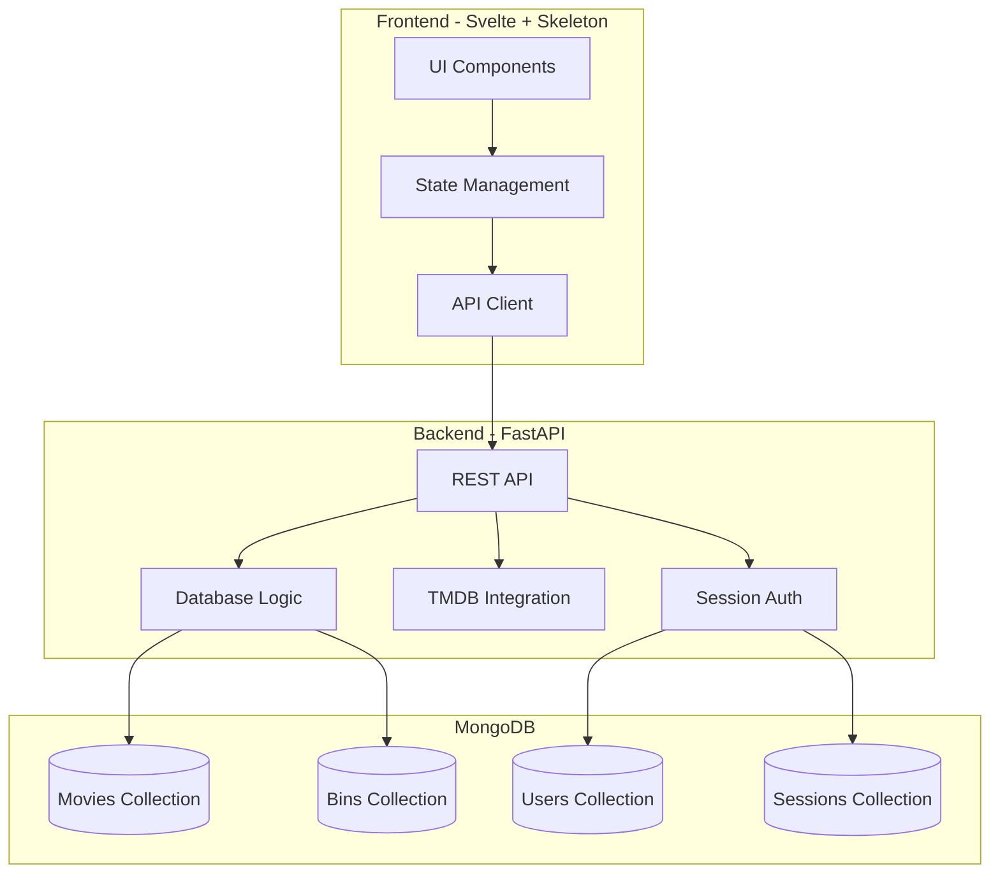
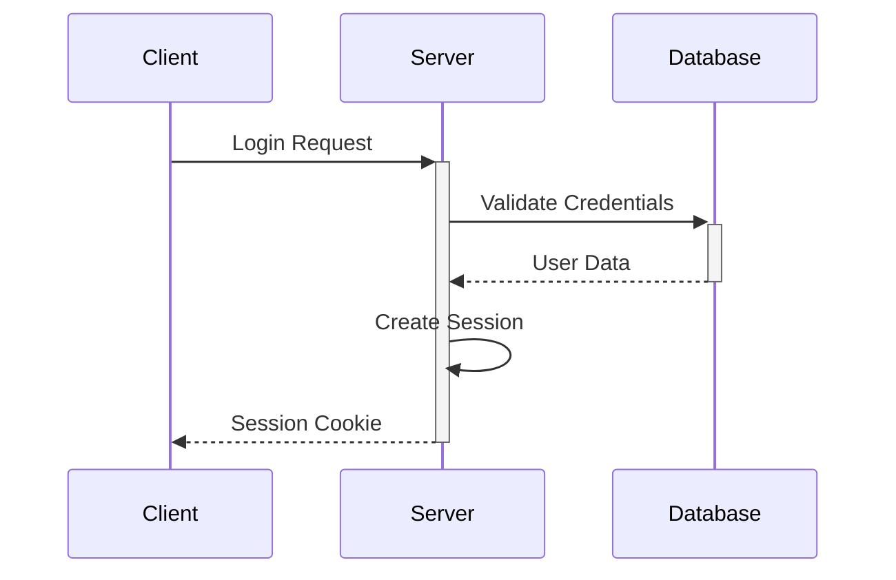
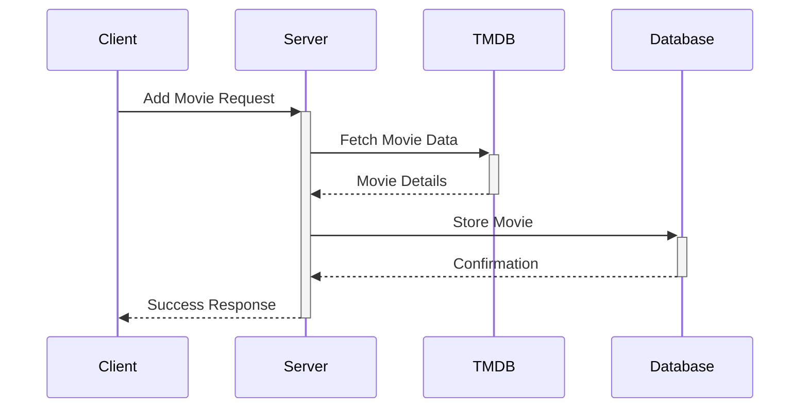

# System Patterns

## Architecture Overview



## Design Patterns

### Backend Patterns

1. Repository Pattern
   - Abstracts database operations
   - Separates data access from business logic
   - Implemented per collection (Movies, Bins, Users)

2. Service Layer Pattern
   - Encapsulates business logic
   - Coordinates between repositories
   - Handles complex operations

3. Dependency Injection
   - FastAPI's built-in DI system
   - Database connections
   - Configuration settings

4. CRUD Operations
   - Standardized REST endpoints
   - Consistent response formats
   - Error handling patterns

### Frontend Patterns

1. Component Architecture
   - Reusable UI components
   - Skeleton UI integration
   - Consistent styling

2. State Management
   - Local component state
   - Shared application state
   - Form handling

3. API Integration
   - Centralized API client
   - Request/response handling
   - Error management

## Data Models

### Movie Schema
```javascript
{
  _id: ObjectId,
  title: String,
  year: Number,
  bin_id: ObjectId,
  format: Enum['DVD', 'Blu-ray', 'Digital'],
  tmdb_id: Number,
  genre: Array<String>,
  runtime: Number,
  cover_image: String
}
```

### Bin Schema
```javascript
{
  _id: ObjectId,
  name: String,
  description: String
}
```

### User Schema
```javascript
{
  _id: ObjectId,
  username: String,
  password_hash: String,
  email: String
}
```

## Critical Implementation Paths

1. Authentication Flow


2. Movie Management


## Integration Points

1. TMDB Integration
   - API client module
   - Rate limiting
   - Error handling
   - Data transformation

2. MongoDB Integration
   - Connection pooling
   - Async operations
   - Schema validation
   - Index optimization

3. Frontend-Backend Integration
   - REST API
   - CORS configuration
   - Authentication headers
   - Error handling

## Security Patterns

1. Authentication
   - Session-based
   - Secure cookie handling
   - CSRF protection

2. Data Validation
   - Input validation
   - Schema validation
   - Type checking

3. Error Handling
   - Standardized error responses
   - Logging
   - User-friendly messages
