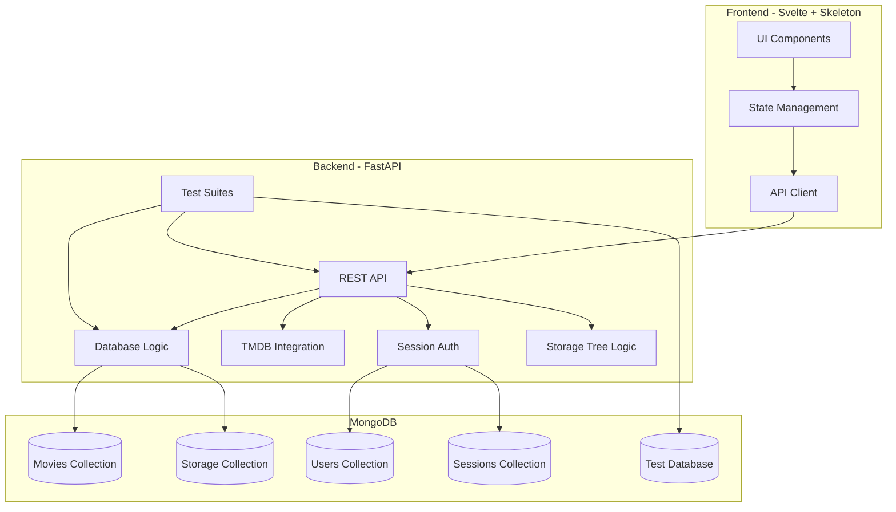
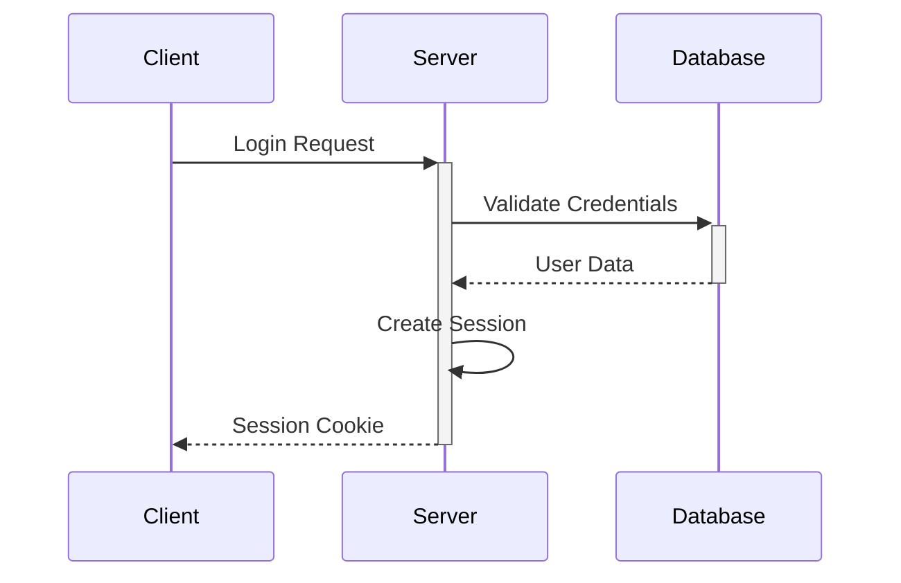
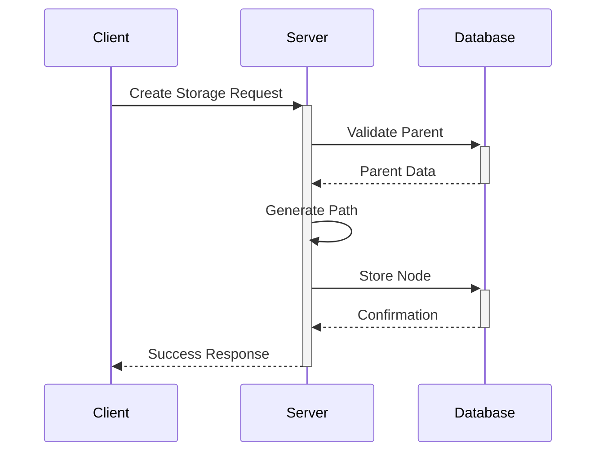
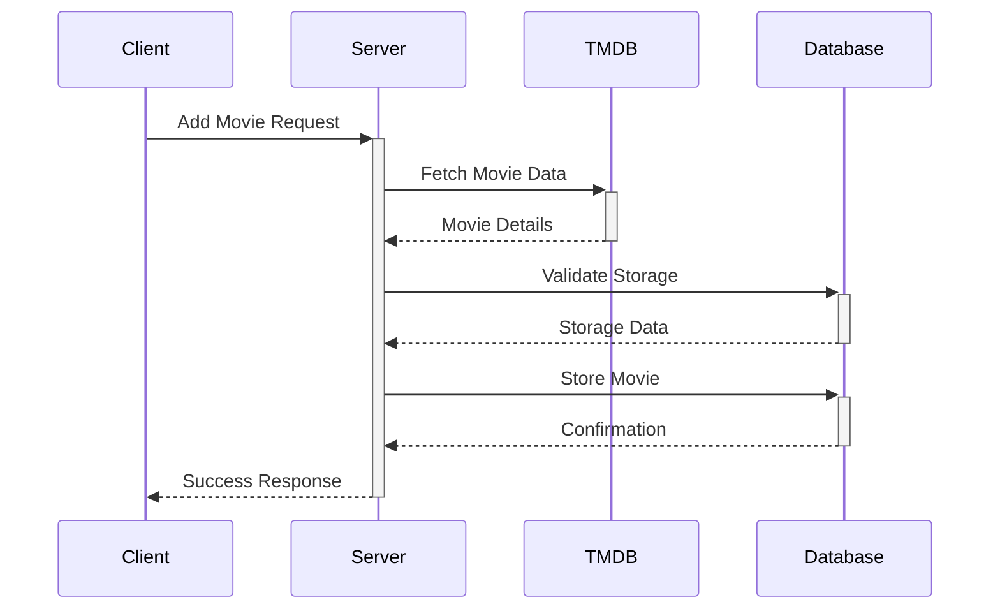

# System Patterns

## Architecture Overview



## Design Patterns

### Backend Patterns

1. Repository Pattern
   - Abstracts database operations
   - Separates data access from business logic
   - Implemented per collection (Movies, Storage, Users)

2. Service Layer Pattern
   - Encapsulates business logic
   - Coordinates between repositories
   - Handles complex operations

3. Tree Structure Pattern
   ```mermaid
   graph TD
       A[Storage Service] --> B[Tree Operations]
       B --> C[Create Node]
       B --> D[Move Node]
       B --> E[Delete Node]
       B --> F[Query Tree]
       
       C --> G[Validate Parent]
       C --> H[Update Path]
       
       D --> I[Update Children]
       D --> J[Rewrite Paths]
       
       F --> K[Get Ancestors]
       F --> L[Get Descendants]
       F --> M[Get Siblings]
   ```

4. Dependency Injection
   - FastAPI's built-in DI system
   - Database connections
   - Configuration settings

5. CRUD Operations
   - Standardized REST endpoints
   - Consistent response formats
   - Error handling patterns

### Testing Patterns

1. Test Database Management
   ```mermaid
   graph TD
       A[Test Setup] --> B[Create Test DB]
       B --> C[Apply Migrations]
       C --> D[Run Tests]
       D --> E[Cleanup]
       E --> F[Drop Test DB]
   ```

2. Test Categories
   ```mermaid
   graph TD
       A[Test Suite] --> B[Unit Tests]
       A --> C[Integration Tests]
       A --> D[Functional Tests]
       A --> E[Performance Tests]
       
       B --> F[Repository Tests]
       B --> G[Service Tests]
       B --> H[Utility Tests]
       
       C --> I[Database Tests]
       C --> J[TMDB Tests]
       C --> K[Auth Tests]
       
       D --> L[API Flow Tests]
       D --> M[Error Tests]
       D --> N[Security Tests]
       
       E --> O[Response Time]
       E --> P[Query Performance]
       E --> Q[Connection Pool]
   ```

3. Test Fixtures
   - Database fixtures
   - Authentication fixtures
   - Mock TMDB responses
   - Utility fixtures

4. Mocking Strategy
   - External API mocks
   - Database mocks when needed
   - Service layer mocks
   - Authentication mocks

### Frontend Patterns (Phase 2B)

1. Component Architecture
   - Reusable UI components
   - Skeleton UI integration
   - Consistent styling

2. State Management
   - Local component state
   - Shared application state
   - Form handling

3. API Integration
   - Centralized API client
   - Request/response handling
   - Error management

## Data Models

### Movie Schema
```javascript
{
  _id: ObjectId,
  title: String,
  year: Number,
  storage_id: ObjectId,  // Reference to any storage type
  format: Enum['DVD', 'Blu-ray', 'Digital'],
  tmdb_id: Number,
  genre: Array<String>,
  runtime: Number,
  cover_image: String
}
```

### Storage Schema
```javascript
{
  _id: ObjectId,
  name: String,
  description: String,
  type: Enum['cabinet', 'shelf', 'bin', 'drawer'],
  parent_id: Optional[ObjectId],
  path: Array<ObjectId>,  // Materialized path for efficient queries
  metadata: {
    capacity: Optional[Number],
    dimensions: Optional[String],
    location: Optional[String]
  }
}
```

### User Schema
```javascript
{
  _id: ObjectId,
  username: String,
  password_hash: String,
  email: String
}
```

## Critical Implementation Paths

1. Authentication Flow


2. Storage Tree Operations


3. Movie Management


4. Testing Flow
```mermaid
sequenceDiagram
    Test->>+TestDB: Setup Test Database
    Test->>+API: Execute Test Cases
    API->>+TestDB: Perform Operations
    TestDB-->>-API: Return Results
    API-->>-Test: Assert Results
    Test->>-TestDB: Cleanup
```

## Integration Points

1. TMDB Integration
   - API client module
   - Rate limiting
   - Error handling
   - Data transformation

2. MongoDB Integration
   - Connection pooling
   - Async operations
   - Schema validation
   - Index optimization
   - Tree structure queries

3. Frontend-Backend Integration
   - REST API
   - CORS configuration
   - Authentication headers
   - Error handling

## Security Patterns

1. Authentication
   - Session-based
   - Secure cookie handling
   - CSRF protection

2. Data Validation
   - Input validation
   - Schema validation
   - Type checking
   - Tree structure validation

3. Error Handling
   - Standardized error responses
   - Logging
   - User-friendly messages

## Testing Strategy

1. Test Environment
   - Isolated test database
   - Mocked external services
   - Controlled test data
   - Reproducible test conditions

2. Test Coverage
   - Repository layer coverage
   - Service layer coverage
   - API endpoint coverage
   - Error handling coverage
   - Tree operations coverage

3. Performance Testing
   - Response time benchmarks
   - Database query analysis
   - Resource utilization metrics
   - Load testing parameters
   - Tree traversal performance
